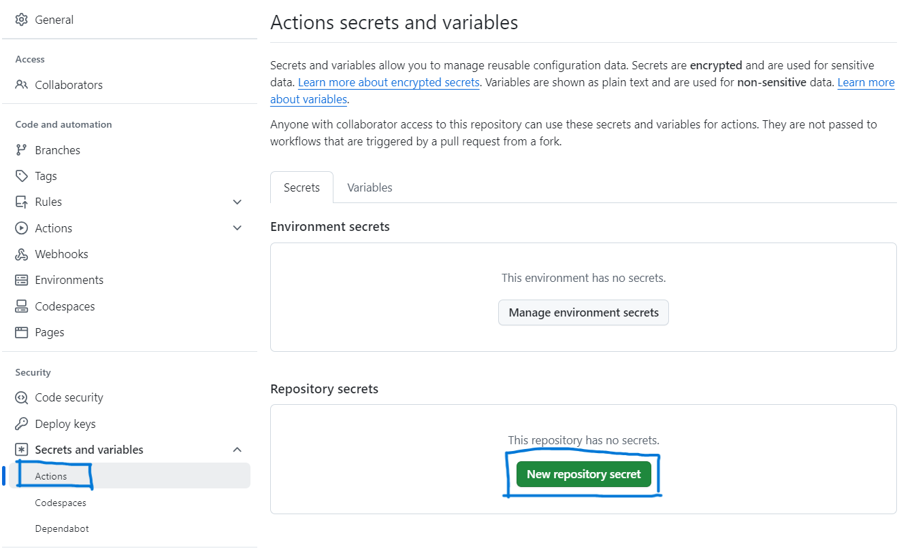
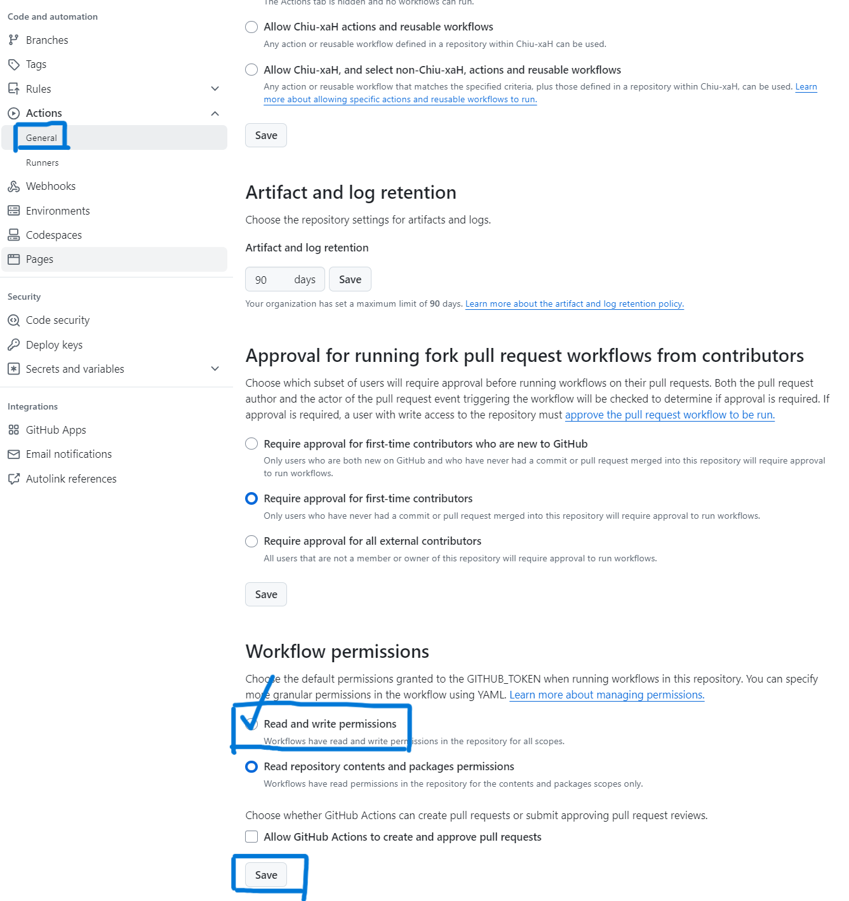

# 长江雨课堂定时签到
**🌟 雨课堂、荷花、黄河等应该就HOST和API不同吧，可以自己试试，改下API应该就行?**

**⚠️ 注意 使用本方式签到再教师端显示为“通过APP正在上课提示进入课堂”，扫码进入的则显示为“通过二维码进入课堂”；不过一般老师搞不明白也没理由质疑，反正两种方式考勤分都是满的**

## 方法1 Github Actions
### 🌟 说明
默认设置为 每周一至周五7:00~22:00，每5min运行一次检查，若发现新的课程则写入log.json；需要定制运行时间，可修改cron表达式,自行学习,注意corn使用0时区时间，应在东八区时间-8

**⚠️ 注意 Actions会存在延迟，并不是准时每5min签到，但是老师只签到时开启几分钟的雨课堂，就有可能被错过**

解决建议：

1.提升签到频率

2.通过Github Actions API搭配自动化任务，定几个重要的上课时间节点，发送网络请求运行Action 

3.转到第二种食用方法-使用服务器部署自动任务，私有算力100%不会延迟

**⚠️ 注意 若Cookie过期，Github会发邮件提示运行失败**

### 🚀 开始配置
1.按下面教程拿到SESSIONID，或者自己抓APP的包

2.按图中路径，配置名为SESSION的环境变量，值为SESSIONID的值



3.继续在设置中，修改选项(为了写入日志)


3.去Action板块直接Run，测试是否通过


4.查看日志log.json签到内容，如果已经签到过不再写入

## 方法2 部署在服务器
### 🌟 说明

**⚠️ 注意 注意设置好运行自动化时的Cookie过期的提醒**

### 🚀 开始配置
1.下载**server-use**文件夹

2.打开config.txt,填写抓包获取的SESSIONID

3.安装依赖
```bash
pip install requests
```
3.定时运行main.py(推荐使用宝塔面板定时任务，具体教程自行搜索)
```python
python main.py
```

4.查看日志log.json签到内容，如果已经签到过不再写入

## 获取SESSIONID方式

访问 https://changjiang.yuketang.cn/ ,登录后，按F12


复制粘贴得到的id到config.txt，并保存即可